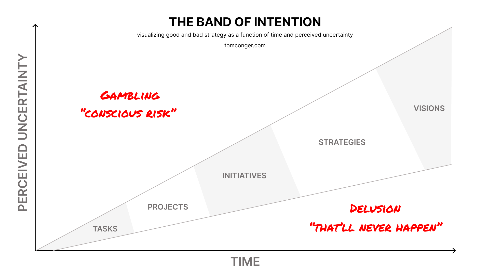

I started my career as the first employee at a startup that had just raised a million dollars, joining two founders a little less than a decade my senior who brought technical and business expertise as well as a grand vision. We were trying to democratize access to justice by overcoming one of the biggest hurdles that people face when trying to get their day in court: paperwork. It’s an innocuous seeming thing, but paperwork that isn’t just-right in the eyes of the court suggests to them that they might waste thousands of dollars and dozens of people’s scarce time and resources, so they’re often quite picky, and the problem that they and their customers (the American people) face is quite big. The courts must balance ease of access for plaintiffs with general efficiency and respect for defendants.

This sort of balancing act is common enough, and I think having read Goldilocks we all get the general idea, but as I was starting my career I didn’t have a strong understanding of how individual and team work went into the balancing act called ‘strategy.’ My work experience in college was somewhat helpful, but ‘building a rocket ship as it goes up’ turns understanding the nature of how work goes into strategy from a nice-to-have to a must-have because working at a startup is all about taking on risk by tackling unknowns and ending up with something useful.

As I see it now, work should be thought of in terms of time and uncertainty when thinking strategically. Here, time represents the period until the work can be completed, not the number of man hours that it necessarily requires, and uncertainty represents the specificity with which we can describe what will have to be done in order to accomplish something.  There are big, obvious, practical differences between ‘let’s lower customer acquisition cost’ v.s. ‘write some seo articles’ v.s. ‘Write s.e.o. articles on these topics with these keywords. Here are the facts you need to include.’ Translating strategy into action is about knowing how to frame situations and find facts to hammer down uncertainty to an acceptable level based on the needs of the company. As I progressed through my time in the company, I was trusted with progressively more ambiguous problems.

The strategic order of operations, if you will, is Visions → Strategies → Initiatives → Projects → Tasks. You move down the chain when you gain a better picture of exactly what needs to happen, but at the same time, they represent a single band of intention.

Suggesting that something is more certain than reality can be thought of as delusion, because you are unknowingly taking on risk like a man who wants to fight a lion having only heard that they are fairly big cats that can’t purr. Taking on greater uncertainty than a given level would typically have, but doing so knowingly, is gambling. Most gamblers lose money. Some win. That’s life. But, if you play the same game long enough you can eventually figure out your odds, being able to state with confidence that $100 invested in marketing will generate $600 in revenue, which will cost $200 to service, and leave you with roughly $300 in extra cash. It can be way more complicated than that, and getting to scale helps you average everything out through the law of large numbers, but it all comes down to managing uncertainty by posing and answering questions that help you understand how a given set of actions will influence the outlook of the company, and then putting your head down and grinding out the work.

As of writing, I’m in the job search. While working at Dispute, I fell in love with technology after a spec I wrote for a customer facing feature saved real, paying customers more than 2 years of time. So how am I thinking about my strategy now that I’ve left my job and am trying to become a software developer full-time?

At a high level, here are the different things I’ve been working on mapped onto the framework I’ve just discussed, broadly titled my ‘band of intention.’

| Level of Intention         | Description       |
| ----------------------- | ------------ |
| Vision | Help people with their toughest, most complicated, and most important problems by leveraging technology |
| Strategy       | Work as a software developer for companies obsessed with their customers |
| Initiative | Get a job as a software developer |
| Projects  | (a) Learn to program (turns out, this is lifelong) (b) Meet really interesting people with compelling stories and problems (c) Share what I learn with allies |
| Tasks  | (a) Solve a few parts of larger problems everyday by using technology (b) Reach out to people in and outside my existing network to talk (c) Write blog posts on my most important lessons |

But what are the risks I’m dealing with! At a task level, any given attempt to apply to a job or have a great conversation could fall flat, and at the project level I could be making a lot of wonderful connections where neither of us is able to help the other. I might misallocate my time and learn oodles but have little to show for it, or I could optimize for getting a job and realize that the foundational skills necessary to excel on the job didn’t happen to include using dynamic programming to make change. So in the face of uncertainty, knowing that what I’m doing at any given moment is probably sub-optimal, I look for leading signals of success and failure, and I experiment.
